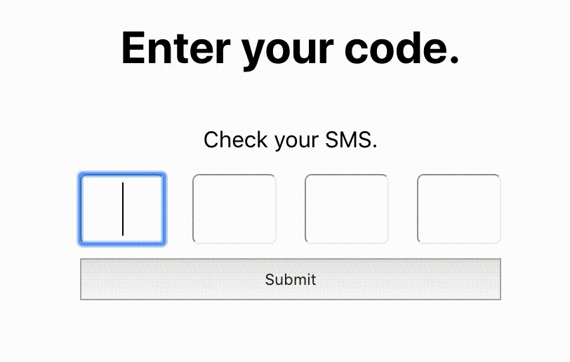

# CodeForm

A form concept that uses React Hooks to accept a code or token of arbitrary length.

---

It auto advances focus as you type numbers into each box and auto submits when all inputs are filled and the focus is on the last element.

It also supports retreating the focus when an input's value is removed.

